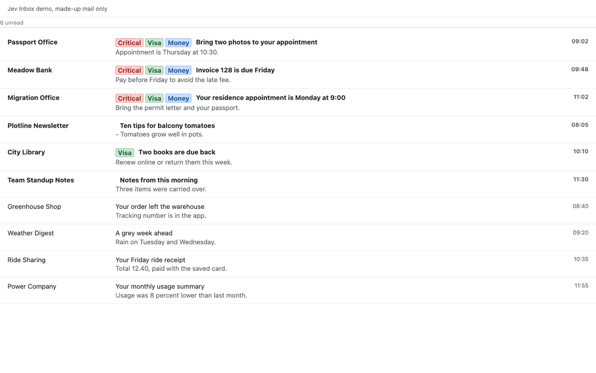

# Jev Inbox for Gmail

Jev Inbox is a Chrome extension that reorders the message list Gmail already renders, on screen only: unread mail moves to the top, the messages that matter most sit above the rest, and every classified row carries chips for your own labels. A thin bar above the list shows the unread count, in-flight progress, and errors. You choose the views it touches (inbox, other inbox tabs, search results, labels and other folders), the provider it classifies through, your labels, and how confident a classification has to be before a row counts as critical. Nothing moves in Gmail's own DOM, so a click, a checkbox, a star, and a hover action always land on the row you see.



## How it works

The content script reads only what the list shows for each unread row: sender display name, sender address, subject, the snippet Gmail renders, and the date. Bodies and attachments are never read and never sent.

Rows are sent in batches of 20 to the service worker, which asks TypeSafe Jev for one evaluation per row:

- `critical`: is this email critical for the recipient (a person waiting on a reply, money or legal matters, a hard deadline, a security or account event)?
- `urgency`: a score from not urgent to immediately urgent.
- One boolean question per label, with your description as the criteria.

Critical rows come first, sorted by urgency and then by critical probability, then the remaining unread rows, then read rows. A row counts as critical when its critical probability reaches the sensitivity you set. Results are cached in `chrome.storage.local` and reused across renders and tabs, and the cache is bounded to 5000 entries. Clearing the cache, editing a label, or switching providers sends the unread rows of the current list through classification again.

## Install from source

```bash
git clone https://github.com/iamomiid/jev-inbox.git
cd jev-inbox
npm install
npm run build
```

Then open `chrome://extensions`, enable Developer mode, choose "Load unpacked", and select the `dist/` folder. Open the extension popup to finish setup.

## Getting a key

Jev Inbox classifies through Jev, reachable either way:

- **Vercel AI Gateway**: create a key in the Vercel dashboard (`https://vercel.com/docs/ai-gateway`), pick "Vercel AI Gateway" in the popup, and paste the key.
- **TypeSafe**: create a key at `https://docs.typesafe.ai`, pick "TypeSafe" in the popup, and paste the key.

Keys stay in `chrome.storage.local`, are only read by the extension's service worker, and are sent only to the provider you selected. The popup keeps only the last four characters of each key, so it can show that one is saved without reading it back; Replace and Remove are there when you want to change it. "Test connection" runs one tiny classification on a fixed dummy state and reports the result inline.

## Labels

Labels are your own categories. Each label has a name, which becomes a chip, and a description, which becomes the question Jev answers. Both the name and the description are sent to the provider with each row as that question's criteria, so do not put sensitive information in them. Good descriptions name the concrete things that belong under the label:

- `Visa`: residence permits, IND letters, immigration appointments.
- `Money`: invoices, payments, bank statements, anything with an amount due.
- `School`: enrollment dates, teacher messages, permission slips.

A label needs both a name and a description before it is saved, and the list is capped at 15. The chip color follows the label's position in the list.

## Privacy

Only row metadata leaves your browser: sender name, sender address, subject, the snippet Gmail shows, and the date, sent to the provider you chose under your own key, together with your label names and descriptions as the criteria for the label questions. No email bodies, no attachments, no analytics, no servers of our own. See [PRIVACY.md](PRIVACY.md) for the full description, including what is stored locally and how to delete it.

## Limitations

- Only the unread rows in the Gmail list currently loaded are classified. Scrolling further classifies more as they appear.
- It only moves rows on screen, never in Gmail's DOM, so Gmail's own clicks, selection, and actions keep pointing at the row you see. It never marks, archives, deletes, or opens mail.
- One tab at a time does the work. Multiple open Gmail tabs share the same cache but each reorders its own list.
- Gmail's markup changes without notice. If Gmail renames the parts of the list, injection stops until the selectors are updated (`docs/gmail-dom.md`).
- Keyboard `j` and `k` follow Gmail's own row order, not the order on screen, so the selection jumps between slots as it moves down the list.
- It is an unofficial project. Not affiliated with Google, TypeSafe, or Vercel.

## Development

```bash
npm run watch      # rebuild on change
npm run typecheck  # tsc --noEmit
```

`npm run build` writes `dist/`, which holds the unpacked extension.

`dev/demo.html` is a standalone Gmail-like list with made-up mail, a stubbed `chrome` API, and canned classifications, so nothing is sent anywhere. Build first, then open the file in Chrome. It accepts `?theme=dark` for the dark list and `?ack=0` to simulate a browser that has not accepted the first-run notice. Clicking a row resolves its thread the way Gmail does, by the row's index in the list, and reports it as `Opened: <subject>` in the demo line, so a wrong mapping shows up as a wrong subject.

`assets/icon.svg` is the icon source. The PNGs next to it are rendered from it and copied into `dist/assets` by the build.

## License

MIT, see [LICENSE](LICENSE).
